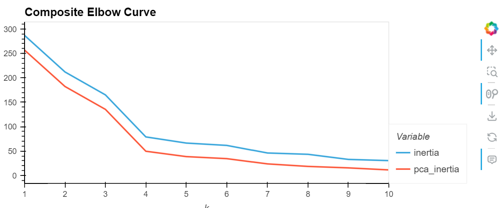
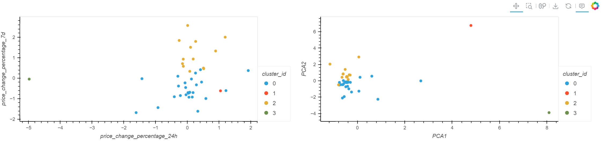

# cryptoClustering

In this project, cryptocurrency prices are analyzed with unsupervised machine learning models to determine clusters of cryptocurrencies fo further analysis.  Price changes over different periods ranging from 24 hours to 1 year were compared for 41 different cryptocurrencies.  The percentage changes were scaled using Standard Scaler, and an elbow curve was constructed to determine the approximate number of clusters within the data.  The elbow curve indicated that there are approximately 4 clusters in the percentage change data.

A k-means model was constructed with the scaled data, using k=4.  

For further analysis, Principal Component Analysis was used to reduce the data into 3 features.  A similar analysis was then performed, with an elbow curve indicating a likely k value of 4.  The k-means model was constructed with the PCA data, and the elbow curves and scatter plots were compared.  The PCA analysis provided extremely similar results.  

The advantage provided by the PCA analysis is simply that fewer features can be used to obtain similar results.  